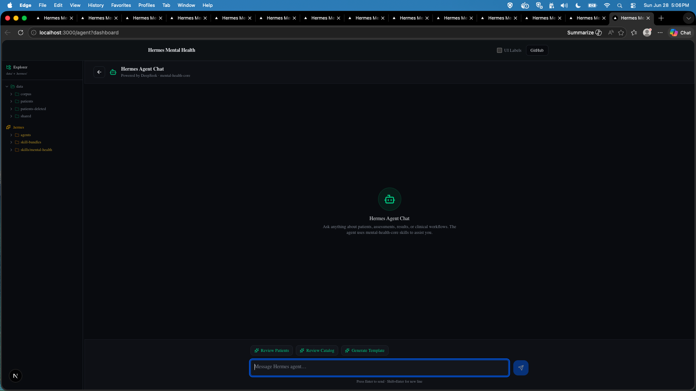

# Agent Chat

**Route:** `/agent`  
**Component:** `app/agent/page.tsx` (server) → `AgentChat`

A full-page AI chat interface for interacting with the Hermes agent. The practitioner types messages directly — no dropdown select, no prompt picker. Context-aware quick-inject buttons populate the input with pre-written clinical prompts.

---

## Page Screenshots



*Agent chat page with filesystem tree sidebar, chat bubbles, and quick-inject buttons.*

---

## Layout

```
┌───────────────────────────────────────────────────────────────┐
│  ← Back                                                   [×] │
├──────────────────────────┬────────────────────────────────────┤
│                          │                                    │
│  Filesystem Tree         │  Agent Chat                        │
│  (collapsible sidebar)   │                                    │
│                          │  ┌─────────────────────────────┐   │
│  data/patients/...       │  │ User message bubble         │   │
│  data/shared/...         │  └─────────────────────────────┘   │
│                          │  ┌─────────────────────────────┐   │
│                          │  │ Assistant markdown bubble   │   │
│                          │  └─────────────────────────────┘   │
│                          │                                    │
│                          │  ┌──────────────────────────────┐  │
│                          │  │ Quick Inject Buttons         │  │
│                          │  │ [Care Plan] [Session Note]   │  │
│                          │  │ [Progress Rpt] [Safety Check]│  │
│                          │  └──────────────────────────────┘  │
│                          │  ┌──────────────────────────────┐  │
│                          │  │ [Type a message...]    [Send]│  │
│                          │  └──────────────────────────────┘  │ 
└──────────────────────────┴────────────────────────────────────┘
```

---

## Navigation

The Agent button in every page header navigates to `/agent` with context-specifying query params:

| Source Page | Link |
|-------------|------|
| Dashboard | `/agent?dashboard` |
| Patient Profile | `/agent?profile&patientId=<id>` |
| Assessments | `/agent?assessments&patientId=<id>` |
| Results | `/agent?results&patientId=<id>` |
| Sessions | `/agent?sessions&patientId=<id>` |
| Notes | `/agent?notes&patientId=<id>` |
| Editor | `/agent?editor&slug=<slug>` |
| Result Detail | `/agent?result&patientId=<id>&resultId=<rid>` |

The **← Back** button resolves its target from the query params.

---

## Quick Inject Buttons

Four emerald buttons below the chat that populate the input with pre-written prompts:

### Care Plan

Injects: *"Audit the existing care plans for the current patient..."* — evaluates existing plans against assessment results, goals, timelines, and safety. Returns quality score, strengths, gaps, and revisions.

**Skills:** `mental-health-core, mental-health-care-plan`

### Session Note

Injects: *"Audit the existing clinical session notes for the current patient..."* — evaluates clinical content against background, assessments, and care plan. Analyzes symptom trajectory, treatment response, safety, and functional changes.

**Skills:** `mental-health-core, mental-health-patient-summary`

### Progress Report

Injects: *"Generate a weekly progress report for the current patient..."* — loads 30-day results, computes trends, renders trend-line charts, and synthesizes a narrative progress note.

**Skills:** `mental-health-core, mental-health-patient-summary`

### Safety Check

Injects: *"Run a safety check for the current patient..."* — reviews PHQ-9 item 9, SI/HI flags, crisis-level severity scores, and generates a safety assessment.

**Skills:** `mental-health-core, mental-health-safety`

---

## Chat Flow

1. Practitioner types a message (or clicks a quick-inject button) and presses Send
2. POST to `/api/agent/chat` with the message content
3. API wraps knowledge of the current patient context into the agent run
4. Hermes Gateway executes the run with mental-health skills loaded
5. Response rendered as markdown bubble
6. Chat history persists in the session

---

## Filesystem Tree Sidebar

The collapsible sidebar shows the project's filesystem tree:
- `data/patients/<id>/` — patient files (results, sessions, notes)
- `data/shared/templates/` — measure templates
- `data/shared/assessments/` — custom assessments

---

## UI Semantics

When **UI Labels** checkbox is toggled on, semantic CSS classes are applied:
- `ui-content-page-agent-chat`
- `ui-header-agent-chat`
- `ui-content-section-agent-sidebar`
- `ui-content-section-agent-messages`
- `ui-content-card-agent-empty` / `agent-loading` / `agent-error`
- `ui-bottom-agent-input`

---

## Key Files

| File | Role |
|------|------|
| `app/agent/page.tsx` | Server: renders AgentChat |
| `app/agent/_components/agent-chat.tsx` | Client: chat bubbles, quick-inject buttons, input |
| `app/agent/_components/agent-sidebar.tsx` | Filesystem tree sidebar |
| `app/api/agent/chat/route.ts` | API: agent chat endpoint |
| `lib/prompts.ts` | Prompt catalog for AgentModal (legacy, not used by chat page) |
---

← [notes](notes.md) | [editor](editor.md) →
