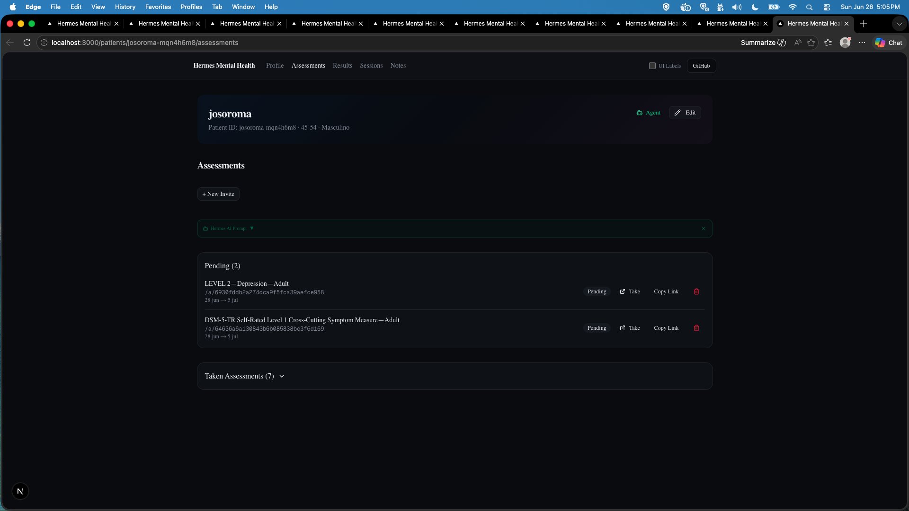

# Assessments

**Route:** `/patients/[id]/assessments`  
**Component:** `app/patients/[id]/assessments/page.tsx` (server) → `AssessmentsSection`

The assessments page manages the lifecycle of assessment invites: creation, sending, tracking completion, and viewing results.

---

## Page Screenshots



*Assessments page showing Create Invite section, pending invites, and Taken Assessments log.*

---

## Layout

```
┌────────────────────────────────────────────────────────────────┐
│  Hermes Mental Health  Profile  Assessments  Results  Sessions │
│                                       Notes  UI Labels  GitHub │
├────────────────────────────────────────────────────────────────┤
│  ┌─ Gradient Cover Header (josoroma) ─────────────────────────┐│
│  └────────────────────────────────────────────────────────────┘│
│                                                                │
│  Assessments                                                   │
│                                                                │
│  ┌────────────────────────────────────────────────────────────┐│
│  │  Create Assessment Invite                                  ││
│  │  ┌───────────────────────────────────────────────────┐     ││
│  │  │  Measure: [Select measure dropdown ▼]             │     ││
│  │  │  Expires in: [Never ▼]                            │     ││
│  │  │  [Create Invite]                                  │     ││
│  │  └───────────────────────────────────────────────────┘     ││
│  └────────────────────────────────────────────────────────────┘│
│                                                                │
│  ┌────────────────────────────────────────────────────────────┐│
│  │  Pending Invites                                           ││
│  │  ┌────────────────────────────────────────────────────────┐││
│  │  │ level1-child-11-17        Jun 27  [Take] [Copy]        │││
│  │  │ clinician-somatic         Jun 21  [Take] [Copy]        │││
│  │  └────────────────────────────────────────────────────────┘││
│  └────────────────────────────────────────────────────────────┘│
│                                                                │
│  ┌─ Taken Assessments (2) ────────────────────────────────────┐│
│  │  level1-child-11-17        Jun 27  [View Result]           ││
│  │  clinician-somatic         Jun 21  [View Result]           ││
│  └────────────────────────────────────────────────────────────┘│
└────────────────────────────────────────────────────────────────┘
```

---

## Create Invite

The **Create Assessment Invite** section at the top of the page has:

- **Measure dropdown** — searches the 68-measure catalog + custom assessments
- **Expires in dropdown** — Never, 24 hours, 7 days, 30 days
- **Create Invite button** — generates a 32-character URL-safe token

On creation:
1. Calls `saveInviteFile()` server action
2. Writes invite JSON to `data/patients/<id>/invites/<ts>-<tokenPrefix>.json`
3. Invite appears in the Pending list with a **Take** link

### Invite File Format

```json
{
  "token": "ef4658cbb73048da8c66a391ec70d426",
  "patientId": "josoroma-mqn4h6m8",
  "assessmentSlug": "level1-child-11-17",
  "status": "pending",
  "createdAt": "2026-06-27T22:58:03.654Z",
  "expiresAt": null
}
```

---

## Pending Invites

Shows only invites with `status: "pending"`. Each invite card has:

| Control | Icon | Action |
|---------|------|--------|
| **Take** | ExternalLink | Opens `/a/<token>` in same tab (patient-facing form) |
| **Copy Link** | Copy | Copies invite URL to clipboard |
| **Delete** | Trash2 | Confirm dialog → `deleteInviteFile()` |

### Delete Confirm Dialog

Messages vary by invite status:
- **Pending:** "This invite hasn't been completed yet and has no results."
- **Completed orphan:** "This invite is marked completed but has no result file."
- **Completed + result:** "Deleting it will also remove the associated assessment result."

---

## Taken Assessments Log

Collapsible section at the bottom showing completed invites. Toggle: "Taken Assessments (N)".

Each item shows:
- **Measure name** and completion date
- **View Result** link → `/patients/[id]/results/[resultId]`
- **Delete** button (same confirm dialog, also deletes associated result file)

### Orphan Detection

If an invite is marked `completed` but no result file exists, the item shows an **"Orphan"** badge (destructive) next to the status.

---

## Data Flow

```
Create Invite        → saveInviteFile()    → data/patients/<id>/invites/<ts>-<token>.json
Patient Takes Form   → /a/<token>           → AssessmentForm component
Form Submit          → saveResultFile()     → data/patients/<id>/results/taken-<ts>-<slug>.json
                     → updateInviteFile()   → sets status to "completed"
                     → router.push()        → /patients/<id>/results/<resultId>
```

---

## Key Files

| File | Role |
|------|------|
| `app/patients/[id]/assessments/page.tsx` | Server component — validates, renders section |
| `app/patients/[id]/_components/assessments-section.tsx` | Invites list with file loading |
| `app/patients/[id]/_components/create-invite.tsx` | Create invite form |
| `lib/actions/invite-files.ts` | `saveInviteFile()`, `listInviteFiles()`, `getInviteByToken()`, `updateInviteFile()`, `deleteInviteFile()` |
| `lib/actions/result-files.ts` | `saveResultFile()`, `deleteResultFile()` |
| `lib/invites/token.ts` | 32-char URL-safe token generation |
| `app/a/[token]/page.tsx` | Patient-facing assessment form page |
| `app/a/[token]/_components/assessment-form.tsx` | Form: scores, saves, redirects |