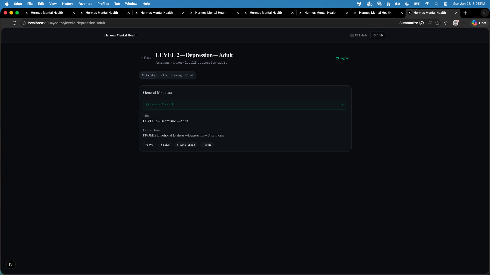
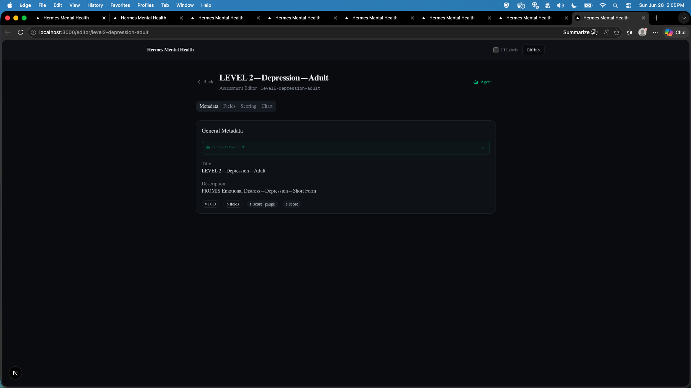

# Dashboard

**Route:** `/`  
**Component:** `app/(dashboard)/page.tsx`

The dashboard is the landing page and central hub for the practitioner. It displays the patient table, assessment library, and access to AI features.

---

## Layout

```
┌────────────────────────────────────────────────────────────────┐
│  Hermes Mental Health                        UI Labels  GitHub │
├────────────────────────────────────────────────────────────────┤
│  Dashboard                                     [Create With AI]│
│  DSM-5-TR assessment management — 3 patients · 78 measures     │
│                                                                │
│  ┌────────────────────────────────────────────────────────────┐│
│  │  Patients                              [AI Prompt] [+ New] ││
│  │  ┌──────────┬──────────┬─────────────────────┬─────────┐   ││
│  │  │ Name     │ Age Range│ Clinical Context    │ Consent │   ││
│  │  ├──────────┼──────────┼─────────────────────┼─────────┤   ││
│  │  │ Carlos R │ 25-34    │ Consulta por ansie… │ granted │   ││
│  │  │ Ana Vega │ 45-54    │ Evaluación por sín… │ pending │   ││
│  │  │ josoroma │ 45-54    │ —                   │ granted │   ││
│  │  └──────────┴──────────┴─────────────────────┴─────────┘   ││
│  │  Rows per page: [10 ▼]  1–3 of 3   [◄] [►]                 ││
│  └────────────────────────────────────────────────────────────┘│
│                                                                │
│  ┌────────────────────────────────────────────────────────────┐│
│  │  Custom Assessments ·10                                    ││
│  │  ┌──────────┐ ┌──────────┐ ┌──────────┐ ┌──────────┐       ││
│  │  │ Adoption │ │ Adoption │ │ Post-Pl… │ │ Divorce… │       ││
│  │  │ Child…   │ │ Family…  │ │ Support… │ │ Care Ne… │       ││
│  │  └──────────┘ └──────────┘ └──────────┘ └──────────┘       ││
│  └────────────────────────────────────────────────────────────┘│
│                                                                │
│  ┌────────────────────────────────────────────────────────────┐│
│  │  Available Assessments ·68                [AI Prompt]      ││
│  │  ┌──────────┐ ┌──────────┐ ┌──────────┐ ┌──────────┐       ││
│  │  │ CFI Core │ │ CFI Alt  │ │ Level 1  │ │ Level 2  │       ││
│  │  │ 1 item   │ │ 1 item   │ │ Adult    │ │ Depress… │       ││
│  │  └──────────┘ └──────────┘ └──────────┘ └──────────┘       ││
│  │  (68 cards total — paginated scroll)                       ││
│  └────────────────────────────────────────────────────────────┘│
└────────────────────────────────────────────────────────────────┘
```

---

## Page Screenshots



*Dashboard — patient table and top of page.*



*Dashboard — Custom Assessments and Available Assessments library.*

---

## Patient Table

The patient table displays all patients from `data/patients/*/profile.json` merged with seed data.

### Features

- **Columns:** Name, Age Range, Clinical Context (truncated), Consent status
- **Sortable:** Click column headers
- **Row click:** Navigates to `/patients/[id]` profile page
- **Delete:** Trash button per row → confirm dialog → moves patient to `data/patients-deleted/`
- **Pagination:** Client-side with page size selector (1, 5, 10, 15, 20, 25, 50, 100). Default: 10.
- **Row count:** "X–Y of Z" display with prev/next buttons

### New Patient

The **+ New Patient** button opens a dialog with:

- **Name** (required) — auto-generates patient ID: `sanitized-name-<timestamp36>`
- **Age Range** — dropdown (Under 18, 18-24, 25-34, 35-44, 45-54, 55-64, 65+)
- **Gender** — dropdown (Masculino, Femenino, No binario, Prefiero no decirlo)
- **Clinical Background** — free-text textarea

On submit, calls `createPatient()` server action which:
1. Validates against `patientSchema` via Zod
2. Creates `data/patients/<id>/` directory
3. Writes `profile.json`
4. Returns `{ success, patient }`

### AI Prompt Hint

The **AI Prompt** button next to the Patients heading opens a green hint box with a pre-written English prompt. The hint has a close button (X) that collapses the green box but keeps the trigger button visible.

---

## Custom Assessments

AI-generated or manually created assessments from `data/shared/assessments/*.json`.

Each card shows:
- **Title** (top)
- **Field count** badge (e.g., "4 items")
- **Description** (line-clamped)
- **Slug** (monospace, muted)
- **Badges:** chart type, scoring type, version

Cards link to `/editor/[slug]` for editing. Hovering reveals a **delete button** (Trash2) at bottom-right with confirm dialog.

---

## Available Assessments

DSM-5-TR measures from the template catalog at `data/shared/templates/json/*.json` (68 measures). Same card layout as Custom Assessments but without delete buttons. Cards link to `/editor/[slug]`.

### AI Prompt Hint

The **AI Prompt** button next to "Available Assessments" shows a green hint with a catalog review prompt.

---

## Create With AI

The **Create With AI** button opens a dialog for generating new assessment templates via the Hermes Gateway API.

### Dialog fields

- **Assessment ID** (slug) — the identifier for the new assessment
- **AI Prompt** (textarea) — natural language description of the assessment

### Flow

1. POST to `/api/assessments/generate` with `{ slug, prompt }`
2. API route calls Hermes Gateway at `http://127.0.0.1:8642/v1/runs`
3. Agent generates assessment JSON
4. JSON saved to `data/shared/assessments/<slug>.json`
5. Route handler reads back, validates against `measureSchema`, fixes slug, rewrites clean copy
6. Card appears in Custom Assessments section

### Requirements

- Hermes Gateway must be running: `API_SERVER_ENABLED=true API_SERVER_KEY=change-me-local-dev hermes gateway`
- Environment variable: `HERMES_ASSESSMENT_AI_URL=http://127.0.0.1:8642/api/ws`
- 300s create timeout, 900s poll deadline, 3s poll interval

---

## Agent Button

The **Agent** button (Bot icon, emerald) in the dashboard header navigates to `/agent?dashboard`. See [Agent Chat](./agent-chat.md) for full documentation.

---

## UI Labels Toggle

The **UI Labels** checkbox in the top banner adds semantic CSS class labels to every major UI element (`ui-content-page-*`, `ui-header-*`, `ui-content-card-*`, etc.) for debugging and screenshot annotation.

---

## Key Files

| File | Role |
|------|------|
| `app/(dashboard)/page.tsx` | Server component — loads patients, passes to client |
| `app/(dashboard)/_components/patient-table.tsx` | Patient table with pagination and delete |
| `app/(dashboard)/_components/create-patient-dialog.tsx` | New patient form dialog |
| `app/(dashboard)/_components/assessment-library.tsx` | Custom + Available assessment card grids |
| `app/(dashboard)/_components/dashboard-hints.tsx` | AI prompt hints |
| `app/(dashboard)/_components/agent-modal.tsx` | Hermes Agent modal (prompt selector + run) |
| `lib/data/patients-server.ts` | Server-only — `listAllPatients()` reads filesystem |
| `lib/actions/create-patient.ts` | Server action — creates patient profile.json |
| `lib/actions/assessment-files.ts` | Server action — deletes custom assessments |