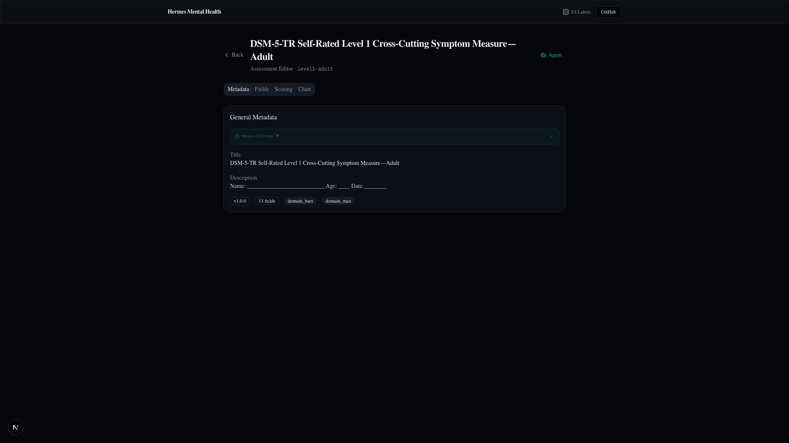

# Assessment Editor

**Route:** `/editor/[slug]`  
**Component:** `app/editor/[slug]/page.tsx`

The assessment editor allows practitioners to view and modify assessment measure metadata, fields, scoring rules, and chart configuration. Supports both DSM-5-TR template measures and custom AI-generated assessments.

---

## Page Screenshots



*Assessment Editor showing Metadata tab with title, description, slug, and version fields.*

---

## Layout

```
┌─────────────────────────────────────────────────────────────────┐
│  Hermes Mental Health                                     GitHub│
├─────────────────────────────────────────────────────────────────┤
│  ← Assessment Editor                          [Agent]           │
│                                                                 │
│  Slug: level2-depression-adult               v1.0.0             │
│                                                                 │
│  ┌─ Metadata ──┬─ Fields ──┬─ Scoring ──┬─ Chart ────────────┐  │
│  │             │           │            │                    │  │
│  │  Title      │  Field 1  │  Type:     │  Chart Type:       │  │
│  │  Description│  Field 2  │  Total     │  severity_bar      │  │
│  │  Slug       │  Field 3  │  Average   │                    │  │
│  │  Version    │  ...      │  T-score   │  Preview:          │  │
│  │  Field Count│           │  DomainMax │  [chart preview]   │  │
│  │             │           │            │                    │  │
│  │             │           │  Thresholds│                    │  │
│  │             │           │  None 0-4  │                    │  │
│  │             │           │  Mild 5-9  │                    │  │
│  │             │           │  ...       │                    │  │
│  └─────────────┴───────────┴────────────┴────────────────────┘  │
└─────────────────────────────────────────────────────────────────┘
```

---

## Tabs

### Metadata Tab

Editable fields:
- **Title** — measure display name
- **Description** — clinical purpose and psychometric properties
- **Slug** — URL-safe identifier (read-only for template measures)
- **Version** — semver string
- **Field Count** — computed from fields array (read-only)

For custom assessments (`data/shared/assessments/<slug>.json`), all fields are editable. For template measures (`data/shared/templates/json/<slug>.json`), the slug is locked.

### Fields Tab

List of measure fields. Each field has:
- **ID** — unique field identifier (e.g., `item_1`, `q1`)
- **Label** — question text displayed to the patient
- **Type** — scale, text, select, multi_select, boolean
- **Required** — toggle
- **Options** — for select/multi_select types
- **Min/Max** — for scale type
- **Reverse Scored** — toggle (for scoring rules)

### Scoring Tab

- **Scoring Type** — total, average, T-score, domain_max
- **Max Scale** — maximum value per item (e.g., 4)
- **Severity Thresholds** — editable ranges:
  - None: 0–4
  - Mild: 5–9
  - Moderate: 10–14
  - Moderately Severe: 15–19
  - Severe: 20–27
- **Auto-compute:** When thresholds are empty, severity is derived from score/maxScore percentage

### Chart Tab

- **Chart Type** — severity_bar, domain_bars, t_score_gauge, trend_line, none
- **Live Preview** — renders the selected chart type with sample data

---

## Data Sources

Tries in order:
1. `getMeasure(slug)` — template catalog at `data/shared/templates/json/<slug>.json`
2. `loadCustomMeasure(slug)` — custom assessments at `data/shared/assessments/<slug>.json`

---

## Key Files

| File | Role |
|------|------|
| `app/editor/[slug]/page.tsx` | Server: loads measure, renders editor |
| `app/editor/[slug]/_components/editor-tabs.tsx` | Tab navigation |
| `app/editor/[slug]/_components/metadata-form.tsx` | Metadata tab form |
| `app/editor/[slug]/_components/fields-tab.tsx` | Fields list with add/remove/reorder |
| `app/editor/[slug]/_components/scoring-tab.tsx` | Scoring type + thresholds |
| `app/editor/[slug]/_components/chart-tab.tsx` | Chart type selector + preview |
| `lib/data/measures.ts` | `getMeasure()`, `loadMeasures()` |
---

← [agent-chat](agent-chat.md) | [assessment-form](assessment-form.md) →
