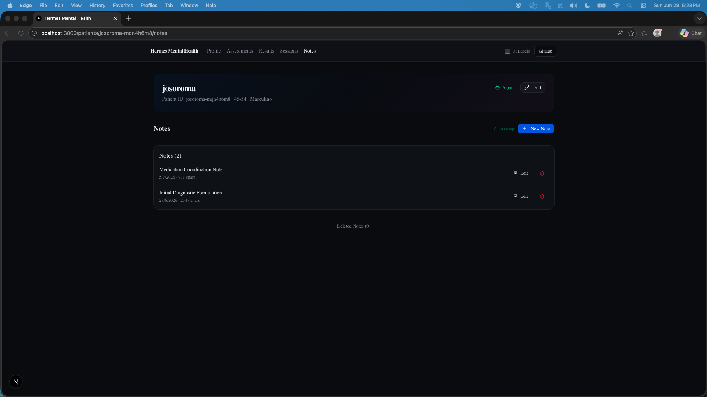

# Notes

**Route:** `/patients/[id]/notes` and `/patients/[id]/notes/[itemId]/{edit,view}`

Notes are general clinical notes (not tied to a specific session). They use the same `ClinicalItemsSection` component as Sessions with `type="note"`.

---

## Page Screenshots



*Notes list page — 2 clinical notes: "Medication Coordination Note" and "Initial Diagnostic Formulation". Each note shows title, date, char count, with View, Edit, and Delete actions. Deleted Notes collapsible toggle at bottom.*

---

## Routes

```
/patients/[id]/notes                              → List page
/patients/[id]/notes/[itemId]/edit                 → MDX editor
/patients/[id]/notes/[itemId]/view                 → Read-only markdown view
```

---

## Template

New notes initialize from `data/shared/templates/md/note-template.json`:

```json
{
  "type": "note",
  "title": "New Note",
  "content": "## Clinical Note\n\n**Date:** \n\n### Purpose\n\n\n### Content\n\n\n### Action Items\n\n",
  "version": "1.0.0"
}
```

---

## Operations

Same as Sessions — create, view, edit, delete — using the same `ClinicalItemsSection` component and `clinical-notes.ts` server actions with `type="note"`.

### File Naming

- **Active:** `data/patients/<id>/notes/<ts>-<itemId>.json`
- **Deleted:** `data/patients/<id>/notes-deleted/deleted-<ts>-<original-filename>`

---

## Key Files

| File | Role |
|------|------|
| `app/patients/[id]/notes/page.tsx` | Server: Notes list |
| `app/patients/[id]/sessions/[itemId]/edit/_components/edit-page.tsx` | MDX editor (reused by notes) |
| `app/patients/[id]/sessions/[itemId]/view/_components/view-page.tsx` | Read-only view (reused by notes) |
| `lib/actions/clinical-notes.ts` | Same server actions as sessions |
| `data/shared/templates/md/note-template.json` | Default note template |
---

← [sessions](sessions.md) | [agent-chat](agent-chat.md) →
