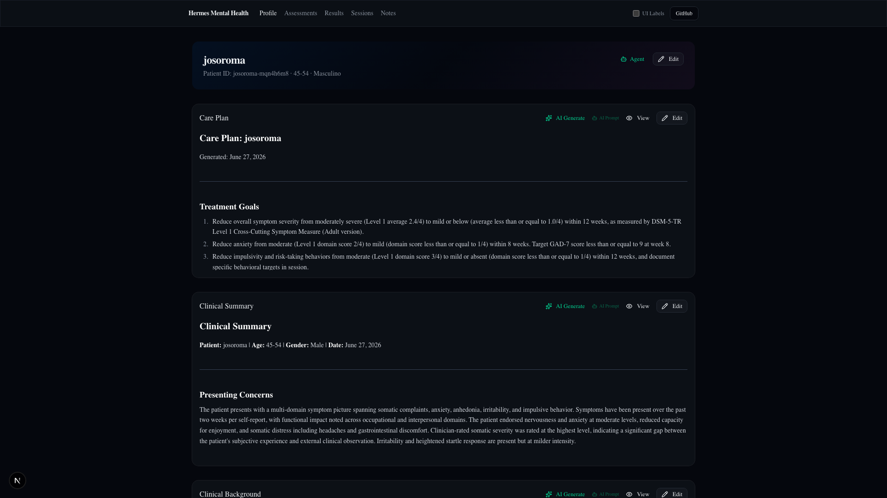
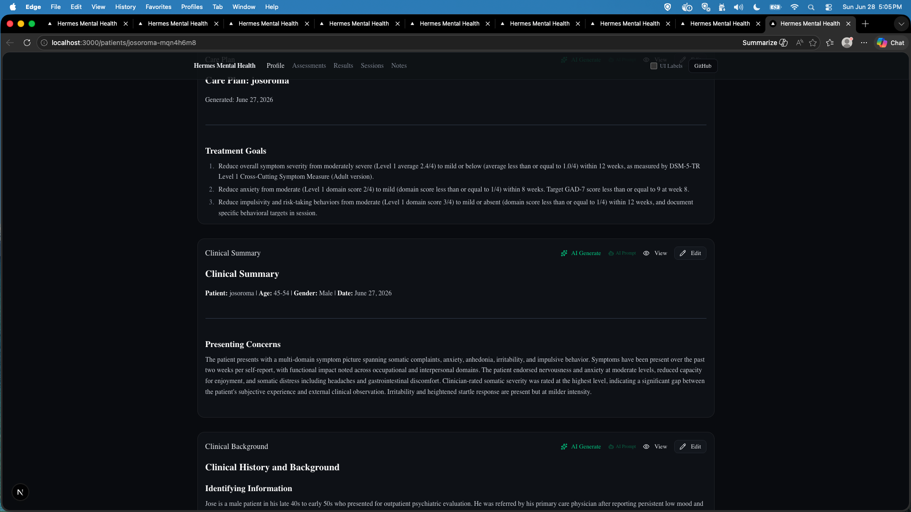

# Patient Profile

**Route:** `/patients/[id]`  
**Component:** `app/patients/[id]/_components/patient-profile.tsx`

The patient profile page is the central hub for an individual patient's clinical data. It displays the demographic header, care plan, clinical summary, clinical background, and consent status.

---

## Page Screenshots



*Patient profile — gradient header and Care Plan card.*



*Patient profile — Clinical Summary, Clinical Background, and Consent.*

---

## Layout

```
┌────────────────────────────────────────────────────────────────┐
│  Hermes Mental Health  Profile  Assessments  Results  Sessions │
│                                       Notes  UI Labels  GitHub │
├────────────────────────────────────────────────────────────────┤
│  ┌────────────────────────────────────────────────────────────┐│
│  │  Gradient Cover Header (dark, editable inline)             ││
│  │  ┌────────────────────────────────────────────────────┐    ││
│  │  │  josoroma                               [Edit]     │    ││
│  │  │  Patient ID: josoroma-mqn4h6m8 · 45-54 · Masculino │    ││
│  │  │  ┌──────────────────────────────────────────────┐  │    ││
│  │  │  │        [Agent button — emerald, Bot icon]    │  │    ││
│  │  │  └──────────────────────────────────────────────┘  │    ││
│  │  └────────────────────────────────────────────────────┘    ││
│  └────────────────────────────────────────────────────────────┘│
│                                                                │
│  ┌────────────────────────────────────────────────────────────┐│
│  │  Care Plan: josoroma        [AI Gen] [Prompt] [View] [Edit]││
│  │  ───────────────────────────────────────────────────────── ││
│  │  Generated: June 27, 2026                                  ││
│  │  ### Treatment Goals (6 goals, preview)                    ││
│  │  ### Recommended Interventions (7 items)                   ││
│  │  ### Follow-up Plan                                        ││
│  │  ### Discharge Criteria                                    ││
│  │  ### Risk Mitigation                                       ││
│  │  (max-h-[300px] scrollable preview)                        ││
│  └────────────────────────────────────────────────────────────┘│
│                                                                │
│  ┌────────────────────────────────────────────────────────────┐│
│  │  Clinical Summary                  [AI Gen] [View] [Edit]  ││
│  │  ───────────────────────────────────────────────────────── ││
│  │  Presenting Concerns | Assessment Findings | Impressions   ││
│  │  (markdown preview)                                        ││
│  └────────────────────────────────────────────────────────────┘│
│                                                                │
│  ┌────────────────────────────────────────────────────────────┐│
│  │  Clinical Background                [AI Gen] [View] [Edit] ││
│  │  ───────────────────────────────────────────────────────── ││
│  │  Identifying Info | History | MSE | Formulation            ││
│  │  (markdown preview)                                        ││
│  └────────────────────────────────────────────────────────────┘│
│                                                                │
│  ┌────────────────────────────────────────────────────────────┐│
│  │  Consent & Dates                                           ││
│  │  ───────────────────────────────────────────────────────── ││
│  │  Consent Status: granted     [Edit]                        ││
│  │  Created: June 20, 2026 · Updated: June 20, 2026           ││
│  └────────────────────────────────────────────────────────────┘│
└────────────────────────────────────────────────────────────────┘
```

---

## Gradient Cover Header

The patient info header is a dark gradient banner at the top with inline editing for demographics.

### Read Mode

- **Name** as `<h1>` heading
- **Subtitle:** Patient ID (monospace) · Age Range · Gender
- **Edit button** (Pencil icon) at top-right

### Edit Mode

Toggled by clicking the Edit button. Replaces read-only display with inline form:

- **Name** — text input (required)
- **Age Range** — dropdown: Under 18, 18-24, 25-34, 35-44, 45-54, 55-64, 65+
- **Gender** — dropdown: Masculino, Femenino, No binario, Prefiero no decirlo
- **Patient ID** — read-only monospace (cannot be changed)
- **Save** / **Cancel** buttons

### Data Source

- Reads from `data/patients/<id>/profile.json` via `readDemographics()` server action
- Falls back to seed data if no file exists
- Save calls `saveDemographics()` which preserves `id`, `createdAt`, bumps `updatedAt`
- Shared layout (`app/patients/[id]/layout.tsx`) provides the header across all patient sub-pages

### Agent Button

The **Agent** button (Bot icon, emerald) is embedded in the header. The link's query params are dynamic based on the current sub-page:
- Profile: `?profile&patientId=<id>`
- Assessments: `?assessments&patientId=<id>`
- Results: `?results&patientId=<id>`
- Sessions: `?sessions&patientId=<id>`
- Notes: `?notes&patientId=<id>`

---

## Editable Markdown Cards

Three markdown cards share the same `EditableMarkdownCard` component:

| Card | File | FileType |
|------|------|----------|
| Care Plan | `data/patients/<id>/care-plan.md` | `care-plan` |
| Clinical Summary | `data/patients/<id>/clinical-summary.md` | `clinical-summary` |
| Clinical Background | `data/patients/<id>/clinical-background.md` | `clinical-background` |

### Card Buttons

| Button | Icon | Action |
|--------|------|--------|
| **AI Generate** | Sparkles (emerald) | POSTs to `/api/clinical/generate` with `hint` prompt → Hermes agent generates markdown → saved with backup to `version/<type>-{ts}.md` |
| **AI Prompt** | Lightbulb | Green hint box showing the reusable English prompt (collapsible) |
| **View** | Eye | Navigates to `/patients/[id]/view/[fileType]` — full-page read-only markdown |
| **Edit** | Pencil | Navigates to `/patients/[id]/edit/[fileType]` — MDX editor |

### AI Generate Flow

1. Practitioner clicks Sparkles button
2. POST `{ patientId, fileType, prompt }` to `/api/clinical/generate`
3. API calls Hermes Agent API at `HERMES_API_SERVER_URL/v1/runs`
4. Polls for completion (2s interval, 5-minute timeout)
5. Strips accidental code fences from agent output
6. **Backs up existing file** to `version/<type>-{yyyy-mm-dd-hh-mm-ss}.md`
7. Saves new content via `saveClinicalFile()`
8. Returns `{ success, fileType, patientId, content }`
9. Card re-reads from file and shows updated content
10. Toast shows backup filename

### AI Prompt Format

The reusable green prompts (hint prop) contain ONLY clinical content — no file paths, no format instructions. All formatting enforcement lives in the API system prompt. See `app/api/clinical/generate/route.ts`.

---

## View Page (`/patients/[id]/view/[fileType]`)

Full-page read-only markdown rendering using `react-markdown` with `prose prose-sm dark:prose-invert`.

- Server component reads the `.md` file
- Passes content to `ViewMarkdownPage` (client component)
- No `next/dynamic` — react-markdown works with SSR

---

## Edit Page (`/patients/[id]/edit/[fileType]`)

Full-page MDX editor using `@mdxeditor/editor` v4.

### Client-only Mount Guard

Uses `useEffect` mount guard — **never** `next/dynamic` (drops server props):

```tsx
const [mounted, setMounted] = useState(false);
useEffect(() => { setMounted(true); }, []);
if (!mounted) return <div>Loading editor…</div>;
return <EditMarkdownPage {...props} />;
```

### MountedRef Guard

Uses `requestAnimationFrame` to delay `mountedRef` so MDXEditor's init-time `onChange` doesn't overwrite loaded content:

```tsx
const mountedRef = useRef(false);
useEffect(() => {
  const id = requestAnimationFrame(() => { mountedRef.current = true; });
  return () => { mountedRef.current = false; cancelAnimationFrame(id); };
}, []);
```

### Dark Mode

Aggressive `!important` CSS overrides with global attribute selectors (`[class*='_contentEditable']`, `[class*='_toolbar']`) for overriding third-party hashed class names. Uses explicit `oklch` values.

---

## Consent Card

Standalone component at `app/patients/[id]/_components/consent-card.tsx`:

### Read Mode

- **Consent Status:** Badge (green for "granted", yellow for "pending", red for "revoked")
- **Dates:** Created · Updated timestamps

### Edit Mode

- **Consent Status dropdown:** granted, pending, revoked
- **Save / Cancel buttons**

### Data Source

- Reads from `data/patients/<id>/consent.json` via `readConsent()` server action
- Falls back to seed data
- Save calls `saveConsent()`

---

## Key Files

| File | Role |
|------|------|
| `app/patients/[id]/layout.tsx` | Shared layout — patient header + children |
| `app/patients/[id]/_components/patient-layout-client.tsx` | Client wrapper — hydrates atom |
| `app/patients/[id]/_components/patient-header.tsx` | Gradient cover header with inline edit |
| `app/patients/[id]/_components/patient-profile.tsx` | Profile page content |
| `app/patients/[id]/_components/editable-markdown-card.tsx` | Reusable card: preview, AI Gen, View, Edit |
| `app/patients/[id]/_components/consent-card.tsx` | Consent status with inline edit |
| `app/patients/[id]/view/[fileType]/page.tsx` | Read-only markdown view |
| `app/patients/[id]/edit/[fileType]/page.tsx` | MDX editor page |
| `app/api/clinical/generate/route.ts` | AI markdown generation API |
| `lib/actions/clinical-files.ts` | `readClinicalFile()`, `saveClinicalFile()`, `saveClinicalFileWithBackup()` |
| `lib/actions/patient-files.ts` | `readDemographics()`, `saveDemographics()`, `readConsent()`, `saveConsent()` |
---

← [dashboard](dashboard.md) | [assessments](assessments.md) →
