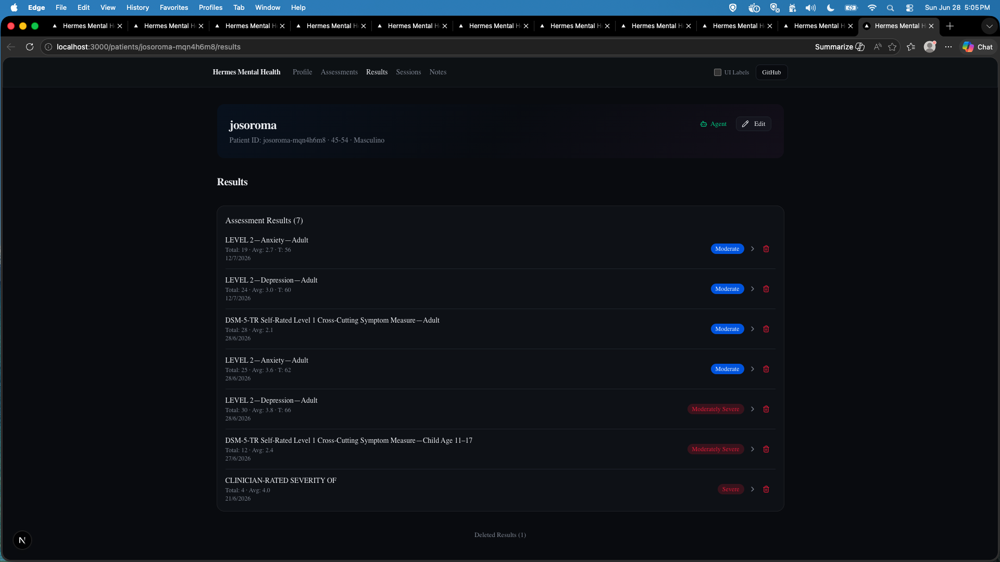
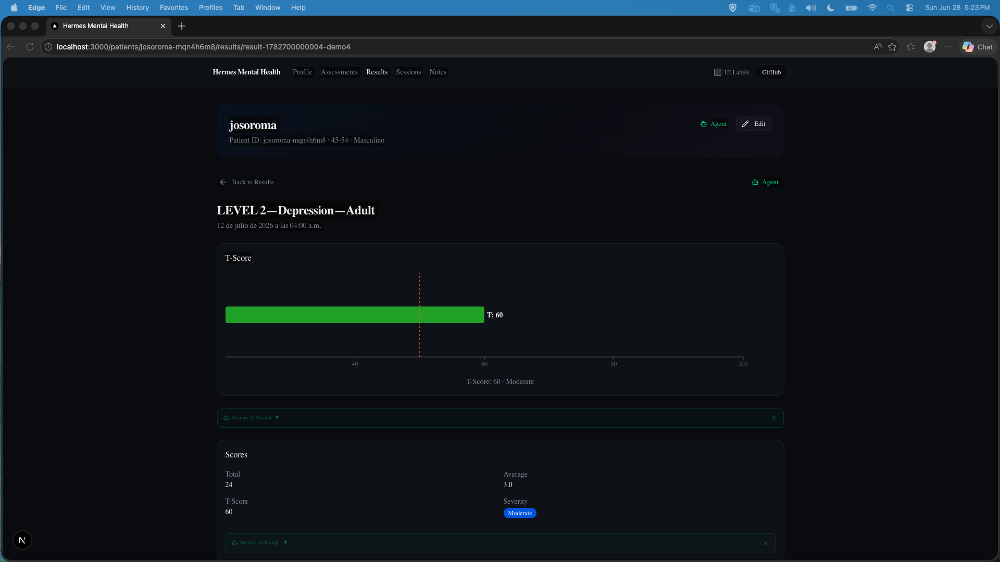
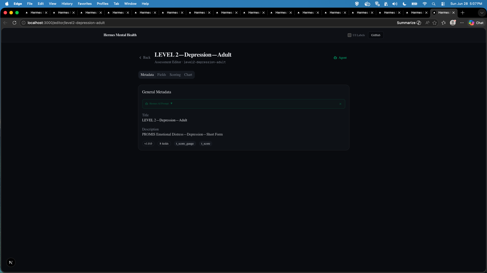
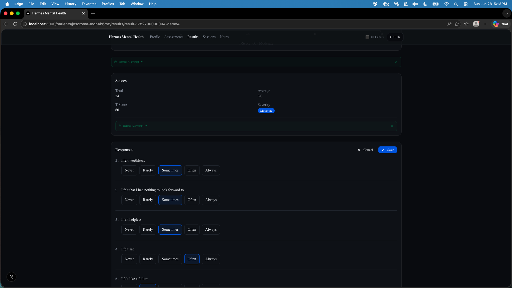

# Results

**Route:** `/patients/[id]/results` and `/patients/[id]/results/[resultId]`

The results section displays scored assessment submissions with severity charts, score breakdowns, and editable answers.

---

## Page Screenshots

### Results List



*Results list page — 7 assessment results sorted by date, each showing measure name, total/average scores, severity badge, and a delete button. Collapsible "Deleted Results" toggle at bottom.*

### Result Detail — Domain Bars Chart


*Level 1 Cross-Cutting result showing a domain bars chart (grouped bars per symptom domain with severity colors), scores card (Total, Average, Severity, Data Quality flags), and the item-level answers breakdown below the chart.*

### Result Detail — T-Score Gauge Chart



*Level 2 Depression follow-up result showing a T-score gauge chart with score marker at T=60 (Moderate). Below the chart: scores card with T-Score, Average, Severity label, and Data Quality status.*

### Result Detail — Edit Mode



*Same result in edit mode — each item becomes an editable scale control. Practitioners can correct responses and save to re-score via the scoring engine.*



*Level 2 Depression result edit mode — 8 items with Never-to-Always radio buttons. The Edit button toggles between view and edit states.*

---

## Results List Page

**Route:** `/patients/[id]/results`  
**Component:** `app/patients/[id]/results/page.tsx` (server) → `ResultsSection`

Displays all scored results sorted by `createdAt` descending. Data comes from `listResultFiles()` server action — passed as props from the server component (no `useEffect` loading).

### Each Result Row

- **Measure name** (resolved from slug via `getMeasureTitle()`)
- **Date** (formatted)
- **Delete button** (Trash2) — confirm dialog → `moveResultToDeleted()`

### Delete Behavior

Deleting a result:
1. **Moves** the result file to `results-deleted/deleted-<ts>-<original-filename>`
2. Deletes the associated invite file
3. Calls `router.refresh()` to update the list

### Deleted Results

Collapsible "Deleted Results (N)" toggle loads from `listDeletedResultFiles()` which reads the `results-deleted/` folder. Each deleted item shows:
- Measure name
- Filename (monospace)
- "Taken: X · Deleted: X" dates

---

## Result Detail Page

**Route:** `/patients/[id]/results/[resultId]`  
**Component:** `app/patients/[id]/results/[resultId]/page.tsx` (server) → `ResultDetail`

### Server Component

1. Validates patient ID
2. Calls `readResultFile(id, resultId)` — scans `results/*.json`
3. Returns 404 if no file found
4. Resolves `measure` via `getMeasure(result.assessmentSlug)`
5. Passes `result` + `measure` as props to `ResultDetail`

### Client Component

Uses `useEffect` + `useSetAtom` to set `activePatientIdAtom` (not `useHydrateAtoms` — causes AppNav render conflict). Uses local `useState(initialResult)` for immediate UI feedback.

### View Mode

```
┌──────────────────────────────────────────────────────────────┐
│  ← Result Detail                                             │
│                                                              │
│  ┌──────────────────────────────────────────────────────────┐│
│  │  DSM-5-TR Self-Rated Level 1 Child Age 11-17             ││
│  │  Jun 27, 2026 · Total: 12 · Average: 2.4                 ││
│  │  Severity: Moderately Severe                             ││
│  │  [severity_bar chart — horizontal bar with 5 bands]      ││
│  └──────────────────────────────────────────────────────────┘│
│                                                              │
│  ┌──────────────────────────────────────────────────────────┐│
│  │  Scores                               [Edit]             ││
│  │  ─────────────────────────────────────────────────────── ││
│  │  Total Score: 12     Average: 2.4                        ││
│  │  Severity: Moderately Severe                             ││
│  │  Data Quality: Complete (no flags)                       ││
│  └──────────────────────────────────────────────────────────┘│
│                                                              │
│  ┌──────────────────────────────────────────────────────────┐│
│  │  Answers                                                 ││
│  │  ─────────────────────────────────────────────────────── ││
│  │  Q1: 2/4  Q5: 2/4  Q7: 2/4  Q9: 3/4  Q11: 3/4            ││
│  └──────────────────────────────────────────────────────────┘│
└──────────────────────────────────────────────────────────────┘
```

### Edit Mode

Clicking **Edit** on the Scores card toggles inline editing. Each measure field renders as its native input type (`scale`, `text`, `select`, `multi_select`, `boolean`). On save:

1. Re-scores via `scoreResult(measure, answers)`
2. Calls `updateResultFile()`
3. Updates local state via `setResult()`
4. Chart re-renders with new scores

### Chart Types

| Chart Type | Used By | Behavior |
|-----------|---------|----------|
| `severity_bar` | PHQ-9, GAD-7, clinician-rated | Horizontal bar with 5 severity bands + score marker |
| `domain_bars` | Level 1 cross-cutting | Grouped bars per domain (renders even for unscorable) |
| `t_score_gauge` | PROMIS measures | Gauge on T-score scale (M=50, SD=10) |
| `trend_line` | Repeat administrations | Score-over-time line chart |
| `none` | Free-text measures | No chart rendered |

Charts are **suppressed** for unscorable results when `severity === "unscorable"` or `total === null` (returns `null`). Exception: `domain_bars` still renders for unscorable results.

### Result JSON Format

```json
{
  "resultId": "result-1782601083654-uatnnx",
  "inviteToken": "ef4658cbb73048da8c66a391ec70d426",
  "patientId": "josoroma-mqn4h6m8",
  "assessmentSlug": "level1-child-11-17",
  "scoring": {
    "total": 12,
    "average": 2.4,
    "tScore": null,
    "severity": "moderately_severe",
    "dataQualityFlags": []
  },
  "answers": { "item_1": 2, "item_5": 2, "item_7": 2, "item_9": 3, "item_11": 3 },
  "createdAt": "2026-06-27T22:58:03.654Z",
  "resultChart": "domain_bars"
}
```

---

## Scoring Engine

`lib/scoring/engine.ts`:

| Scoring Type | Formula |
|-------------|---------|
| **Total** | Sum of all item scores |
| **Average** | Mean score across items |
| **T-score** | PROMIS standardized (M=50, SD=10) |
| **Domain max** | Highest score within each domain |

### Auto-computed Severity

When a measure has empty `severityThresholds`:
- 0% – <20% → none
- 20% – <40% → mild
- 40% – <60% → moderate
- 60% – <80% → moderately_severe
- ≥80% → severe

---

## Key Files

| File | Role |
|------|------|
| `app/patients/[id]/results/page.tsx` | Server: loads results from files |
| `app/patients/[id]/results/[resultId]/page.tsx` | Server: reads result file, resolves measure |
| `app/patients/[id]/results/[resultId]/_components/result-detail.tsx` | Result view + edit mode |
| `app/patients/[id]/_components/results-section.tsx` | Results list with delete |
| `lib/actions/result-files.ts` | `saveResultFile()`, `readResultFile()`, `listResultFiles()`, `updateResultFile()`, `moveResultToDeleted()`, `listDeletedResultFiles()` |
| `lib/scoring/engine.ts` | Scoring: total, average, T-score, domain max, severity |
| `components/result-chart.tsx` | Chart component (severity bars, domain bars, gauges) |