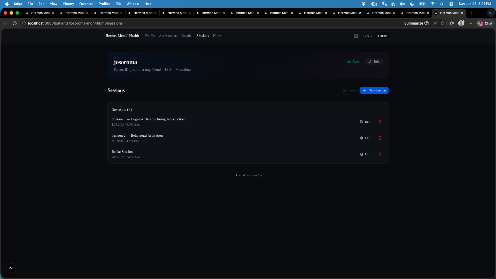

# Sessions

**Route:** `/patients/[id]/sessions` and `/patients/[id]/sessions/[itemId]/{edit,view}`

Sessions are clinical notes documenting individual therapy sessions. They use the same `ClinicalItemsSection` component as Notes with `type="session"`.

---

## Page Screenshots



*Sessions list page with New Session button and session items.*

---

## Routes

```
/patients/[id]/sessions                         → List page
/patients/[id]/sessions/[itemId]/edit            → MDX editor
/patients/[id]/sessions/[itemId]/view            → Read-only markdown view
```

---

## Layout — List Page

```
┌───────────────────────────────────────────────────────────────┐
│  Hermes Mental Health  Profile  Assessments  Results  Sessions│
│                                       Notes  UI Labels  GitHub│
├───────────────────────────────────────────────────────────────┤
│  ┌─ Gradient Cover Header (josoroma) ────────────────────────┐│
│  └───────────────────────────────────────────────────────────┘│
│                                                               │
│  Sessions                                     [+ New Session] │
│                                                               │
│  ┌───────────────────────────────────────────────────────────┐│
│  │  New Session                    Jun 27 · 568 chars        ││
│  │                                        [View] [Edit]      ││
│  └───────────────────────────────────────────────────────────┘│
│                                                               │
│  ┌─ Deleted Sessions (2) ────────────────────────────────────┐│
│  │  (collapsed by default)                                   ││
│  └───────────────────────────────────────────────────────────┘│
└───────────────────────────────────────────────────────────────┘
```

---

## ClinicalItem Type

```ts
interface ClinicalItem {
  id: string;         // "session-<ts>-<random>"
  type: "session";
  title: string;
  content: string;    // markdown
  createdAt: string;
  updatedAt: string;
}
```

---

## Template

New sessions initialize from `data/shared/templates/md/session-template.json`:

```json
{
  "type": "session",
  "title": "New Session",
  "content": "## Clinical Session\n\n**Date:** \n**Duration:** \n**Type:** Individual / Group / Family\n\n### Presenting Concerns\n\n\n### Mental Status Exam\n\n- **Appearance:** \n- **Behavior:** \n...\n\n### Session Content\n\n\n### Interventions\n\n\n### Response to Intervention\n\n\n### Plan / Homework\n\n\n### Next Session\n\n**Date:** \n**Focus:** ",
  "version": "1.0.0"
}
```

---

## Operations

### Create

**+ New Session** button calls `createClinicalItem(patientId, "session")`:
1. Loads template from `session-template.json`
2. Generates item ID: `session-<ts>-<random>`
3. Writes to `data/patients/<id>/sessions/<ts>-<itemId>.json`
4. Appears in the list

### View

**View** link navigates to `/patients/[id]/sessions/[itemId]/view`. Read-only `react-markdown` rendering with Back button and Edit button.

### Edit

**Edit** link navigates to `/patients/[id]/sessions/[itemId]/edit`. Full MDX editor using `@mdxeditor/editor` v4 with:
- Editable title (inline input)
- Markdown content editor
- Save (calls `saveClinicalItem()`) / Cancel buttons
- Dark mode CSS identical to clinical-summary edit page

### Delete

**Trash** button opens confirm dialog. Deleting calls `deleteClinicalItem()` which **moves** the file to `sessions-deleted/deleted-<ts>-<original-filename>` — never truly deletes.

### Deleted Sessions

Collapsible "Deleted Sessions (N)" toggle at the bottom of the list. Loads from `listDeletedClinicalItems()`.

---

## File Naming

- **Active:** `data/patients/<id>/sessions/<ts>-<itemId>.json`
- **Deleted:** `data/patients/<id>/sessions-deleted/deleted-<ts>-<original-filename>`

---

## Key Files

| File | Role |
|------|------|
| `app/patients/[id]/sessions/page.tsx` | Server: Sessions list |
| `app/patients/[id]/sessions/[itemId]/edit/_components/edit-page.tsx` | MDX editor |
| `app/patients/[id]/sessions/[itemId]/view/_components/view-page.tsx` | Read-only markdown view |
| `app/patients/[id]/_components/clinical-items-section.tsx` | Reusable list component (sessions + notes) |
| `lib/actions/clinical-notes.ts` | `createClinicalItem()`, `listClinicalItems()`, `readClinicalItem()`, `saveClinicalItem()`, `deleteClinicalItem()` |
| `data/shared/templates/md/session-template.json` | Default session template |